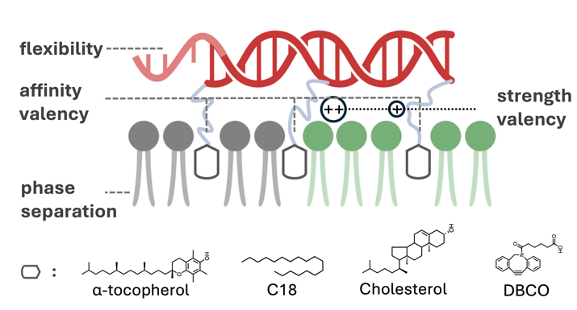
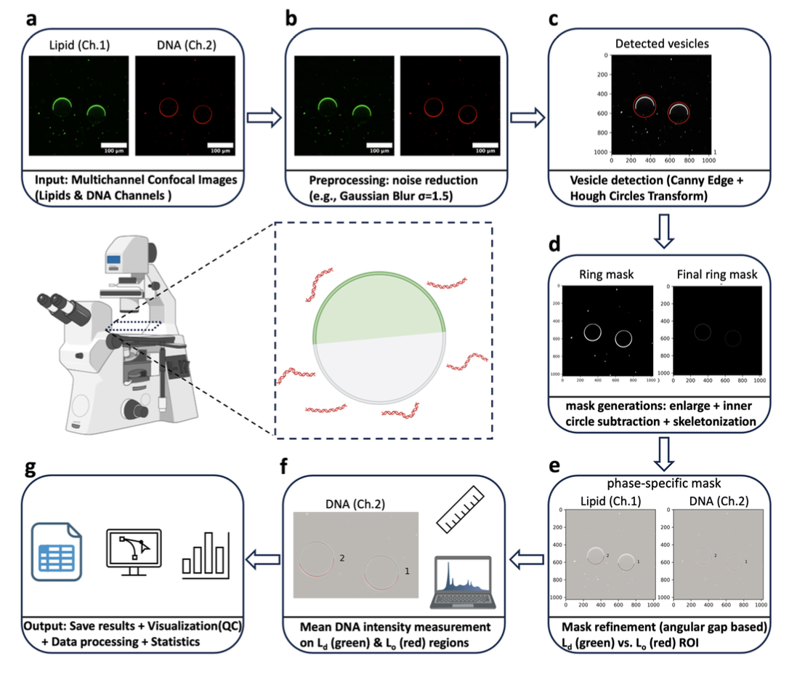

# Image Processing Pipeline for Phase-Separated GUVs

[](https://doi.org/10.1021/acsami.5c13271)
[](https://opensource.org/licenses/MIT)

---

## Scientific Context: DNA Partitioning in GUVs

This software is the official validated computational supplementary for the analysis of DNA-lipid partitioning selectivity in Giant Unilamellar Vesicles (GUVs).

> This graphic from our publication summarizes the parameters of Hydrophobic and Electrostatic interactions that govern DNA partitioning across liquid-ordered ($L_o$) and liquid-disordered ($L_d$) lipid domains.




## Publication
This code was developed and used for the analysis presented in:
> **Hierarchy of Hydrophobic and Electrostatic Interactions in DNA–Membrane Phase Selectivity** > *Siu Ho Wong, Yameng Lou, Yuduo Chen, Diana Morzy, and Maartje M.C. Bastings* > **ACS Applied Materials & Interfaces 2025** 17 (46), 63871-63881  
> [Read the paper here](https://doi.org/10.1021/acsami.5c13271)

## Scientific Utility
The pipeline processes dual-channel confocal microscopy images to characterize liquid-ordered ($L_o$) and liquid-disordered ($L_d$) lipid domains. It is specifically optimized for:
* **Vesicle Segmentation:** Automated detection of membranes using Channel 1 (e.g., Liss Rhod).
* **Partitioning Quantification:** Intensity analysis of markers (e.g., DNA) in Channel 2 across phase-separated regions.
* **Robustness:** Handles high-density GUV environments using custom enlargement and thresholding logic.

---
## 🚀 Automated Analysis Pipeline

To quantify DNA partitioning, I developed a multi-stage signal processing pipeline. The flowchart below illustrates the high-level stages of the automated analysis.

<p align="center">
  
</p>

**Automated image processing and analysis pipeline of DNA partitioning in GUVs:**
* **(a-b) Preprocessing:** Multi-channel confocal images are enhanced to improve the Signal-to-Noise Ratio (SNR).
* **(c) Detection:** GUVs are localized using the **Hough Circle Transform**. Note: Axes (c-e) present a 1.5x zoom factor (378.79 nm/pixel).
* **(d-e) Segmentation:** Generation of precise masks to differentiate liquid-ordered ($L_o$) and liquid-disordered ($L_d$) phases.
* **(f-g) Quantification:** Automated measurement of DNA fluorescence intensities and phase areas, resulting in final visualization plots and CSV outputs.

---

## Requirements

- Python 3.10 or higher
- Libraries:
  - `numpy`
  - `pandas`
  - `opencv-python`
  - `scikit-image`
  - `matplotlib`
  - `scipy`

## Installation

1. Clone this repository:
   ```
   git clone https://github.com/Herbert-Wong25/Phase-separated_GUVs_Image_Analysis_2025.git
   ```
2. Navigate to the repository directory:
   ```
   cd Phase-separated_GUVs_Image_Analysis_2025
   ```
3. Install the required libraries:
   ```
   pip install -r requirements.txt
   ```
   *Note*: Create a `requirements.txt` file by running `pip freeze > requirements.txt` in your Python environment, or manually list the libraries above.

## Usage

1. Place your multi-channel TIFF images (e.g., `ome.tif` files) in a folder structure like `image_folder/library_name/`.
2. Update the `image_folder` path in the notebook to point to your image directory:
   ```python
   image_folder = "/path/to/your/images"
   ```
3. Adjust parameters in the "Adjustable Parameters" section if needed (e.g., `enlargement_factor`, `threshold_method`).
4. Run all cells in the notebook to process images and generate results.

## Input Data

- **Format**: Multi-channel TIFF images (e.g., from confocal microscopy).
- **Channels**:
  - Channel 1: Vesicle membranes (e.g., Liss Rhod).
  - Channel 2: Marker distribution (e.g., DNA labeled with Cy5).
- **Naming**: Images should be in subfolders with "-d84" in the name and end with "ome.tif".

## Output

- **CSV File**: `Analysis.csv` in the `_processed_1` subfolder, containing measurements for each vesicle (e.g., areas, mean/max DNA intensities in Ld/Lo regions).
- **Visualization Images**: TIFF files (e.g., `library_image_analysis.tif`) in the `_processed_1` subfolder, showing detected vesicles, masks, and Ld/Lo regions.

## Parameters

- `enlargement_factor`: Factor to enlarge the detected vesicle radius for the ring mask (default: 1.2).
- `inner_percentage`: Fraction of the enlarged radius for the inner boundary of the ring mask (default: 0.7).
- `threshold_method`: Method to segment Ld/Lo phases (default: 'otsu'; options: 'otsu', 'mean', 'median', 'percentile', 'fixed', 'mean_plus_std').
- `fixed_threshold`: Value used if `threshold_method` is 'fixed' (default: 100).
- `min_arc_size`: Minimum size to filter small Ld/Lo clusters (default: 50).

## Example

To process images in `/Users/my_images`:
1. Update the notebook:
   ```python
   image_folder = "/Users/my_images"
   ```
2. Run the notebook. Results will appear in `/Users/herbert/my_images_processed_1/`.

## Contact

For questions or issues, contact Herbert Siu-Ho Wong at [herbert.wong150@gmail.com] or open an issue on this repository.

## License

This project is licensed under the MIT License - see the [LICENSE](LICENSE) file for details.
