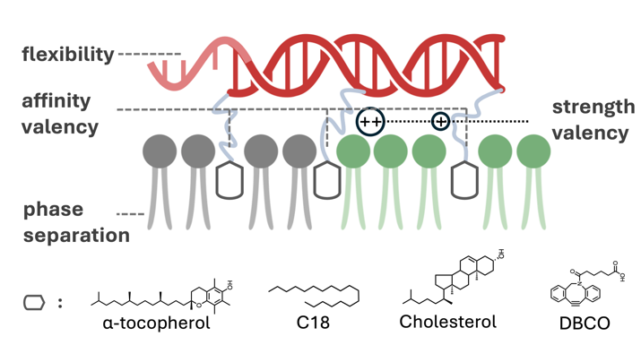
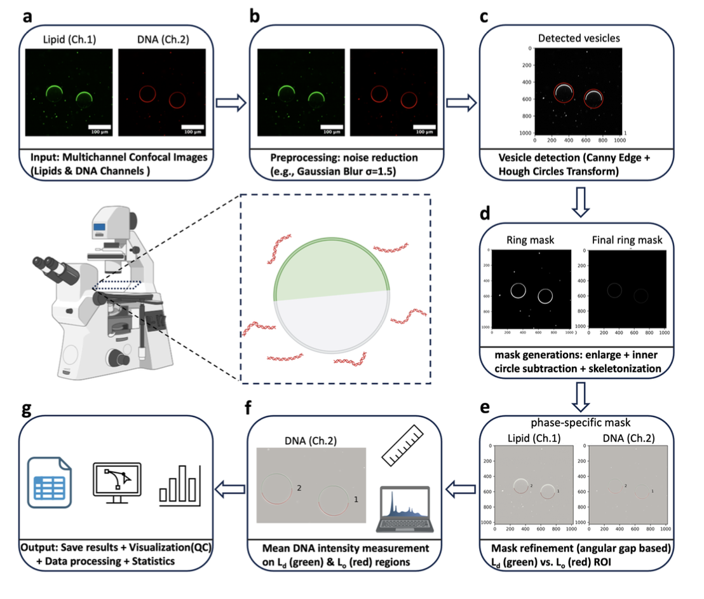

# Image Processing Pipeline for Phase-Separated GUVs

[](https://doi.org/10.1021/acsami.5c13271)
[](https://opensource.org/licenses/MIT)

---

## Scientific Context

This is the official validated computational pipeline for the analysis of DNA–lipid partitioning selectivity in Giant Unilamellar Vesicles (GUVs), published in:

> **Hierarchy of Hydrophobic and Electrostatic Interactions in DNA–Membrane Phase Selectivity**
> *Siu Ho Wong, Yameng Lou, Yuduo Chen, Diana Morzy, and Maartje M.C. Bastings*
> **ACS Applied Materials & Interfaces 2025**, 17(46), 63871–63881
> [DOI: 10.1021/acsami.5c13271](https://doi.org/10.1021/acsami.5c13271)

The pipeline processes dual-channel confocal microscopy images to quantify how DNA nanostructures selectively partition between liquid-ordered ($L_o$) and liquid-disordered ($L_d$) lipid domains — a key question for understanding membrane-targeted drug delivery.

> The graphic below from our publication summarises the hierarchy of hydrophobic and electrostatic interactions governing DNA phase selectivity in GUVs.



---

## Automated Analysis Pipeline

<p align="center">
  
</p>

The pipeline runs six sequential stages on each vesicle:

| Stage | Description |
|---|---|
| **1. Detection** | Gaussian smoothing → Canny edge detection → Hough Circle Transform for vesicle localisation |
| **2. Masking** | Ring mask generation (enlarged outer radius, inner cutoff) refined by least-squares circle fit to the DNA channel |
| **3. Segmentation** | Intensity thresholding + Angular Gap Analysis to delineate $L_d$ and $L_o$ arcs along the membrane |
| **4. Post-processing** | Morphological closing → skeletonisation → dilation for precise contour sampling |
| **5. Quantification** | Mean/max fluorescence intensities, phase areas, and geometric metadata extracted per vesicle |
| **6. Visualisation** | 4-panel QC figure saved per image (TIFF, 300 dpi) showing raw image, masks, and segmented phases |

---

## Requirements

- Python 3.10 or higher
- Libraries:
  - `numpy`
  - `pandas`
  - `opencv-python-headless`
  - `scikit-image`
  - `matplotlib`
  - `scipy`

---

## Installation

1. Clone this repository:
   ```bash
   git clone https://github.com/Herbert-Wong25/Selective_Membrane_Targeting_of_Nanostructure.git
   ```
2. Navigate to the repository directory:
   ```bash
   cd Selective_Membrane_Targeting_of_Nanostructure
   ```
3. Install the required libraries:
   ```bash
   pip install -r requirements.txt
   ```

---

## Usage

1. Place your multi-channel TIFF images in `data/raw/`, organised into subfolders with `-d84` in the name:
   ```
   data/raw/
   └── Batch1-d84/
       ├── image_01_ome.tif
       └── image_02_ome.tif
   ```
2. Open `GUV_Analysis_Pipeline.ipynb` and confirm paths in **Section 1** — by default the notebook uses `os.getcwd()` so no edits are needed if run from the repo root.
3. Adjust parameters in **Section 2** if needed (see Parameters below).
4. Run all cells. Results are saved automatically to `data/processed/`.

---

## Input Data

| Property | Detail |
|---|---|
| **Format** | Multi-channel TIFF (e.g., `.ome.tif` from confocal microscopy) |
| **Channel 0** | Vesicle membranes — Liss Rhod fluorescent lipid |
| **Channel 1** | Marker distribution — Cy5-labelled DNA |
| **Folder naming** | Subfolders must contain `-d84` in their name |
| **File naming** | Files must contain `ome.tif` |

---

## Output

| File | Location | Contents |
|---|---|---|
| `Analysis_Results.csv` | `data/processed/` | Per-vesicle metrics: $L_d$/$L_o$ areas, mean/max DNA intensities, geometry |
| `[library]_image_analysis.tif` | `data/processed/` | 4-panel QC visualisation per image |

---

## Parameters

All parameters are set in **Section 2** of the notebook:

| Parameter | Default | Description |
|---|---|---|
| `enlargement_factor` | `1.2` | Outer ring radius = detected radius × factor |
| `inner_percentage` | `0.7` | Inner ring boundary = outer radius × percentage |
| `threshold_method` | `'otsu'` | $L_d$/ $L_o$ segmentation method: `'otsu'`, `'mean'`, `'median'`, `'percentile'`, `'fixed'`, `'mean_plus_std'` |
| `fixed_threshold` | `100` | Intensity value used when `threshold_method = 'fixed'` |
| `min_arc_size` | `50` | Minimum pixel count to retain an $L_d$/$L_o$ cluster |
| `closing_radius` | `3` | Morphological closing disk radius |
| `skeleton_width` | `1` | Dilation disk radius on skeletonised contours |

---

## 📂 Project Structure

```
/
├── GUV_Analysis_Pipeline.ipynb   # Main analysis pipeline
├── requirements.txt
├── LICENSE
├── assets/                       # Figures for documentation
│   ├── graphical_abstract.png
│   └── processing_graphics.png
├── data/
│   ├── raw/                      # Input: microscopy TIFFs
│   └── processed/                # Output: CSV results + QC figures
└── notebooks/                    # Development history (raw pipeline)
```

---

## Contact

For questions or issues, contact Herbert Siu-Ho Wong at [herbert.wong150@gmail.com](mailto:herbert.wong150@gmail.com) or open an issue on this repository.

## License

This project is licensed under the MIT License — see the [LICENSE](LICENSE) file for details.
